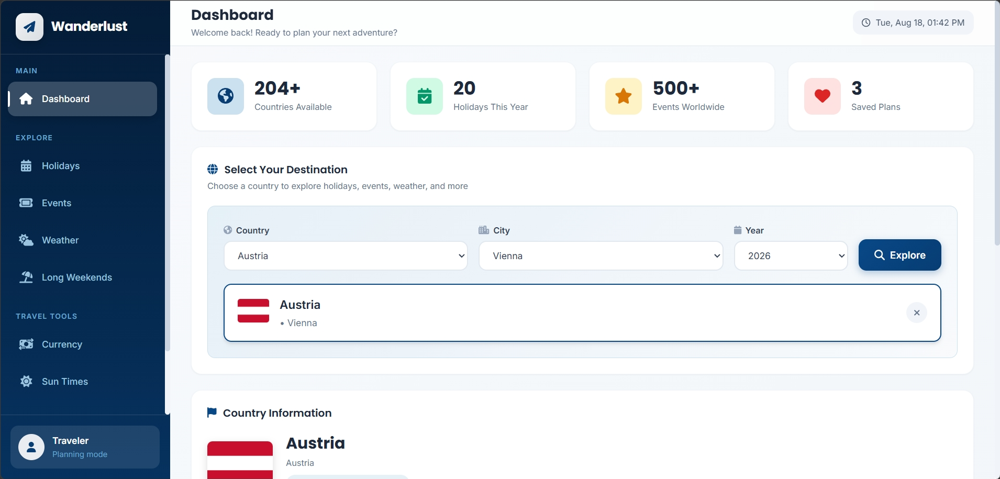
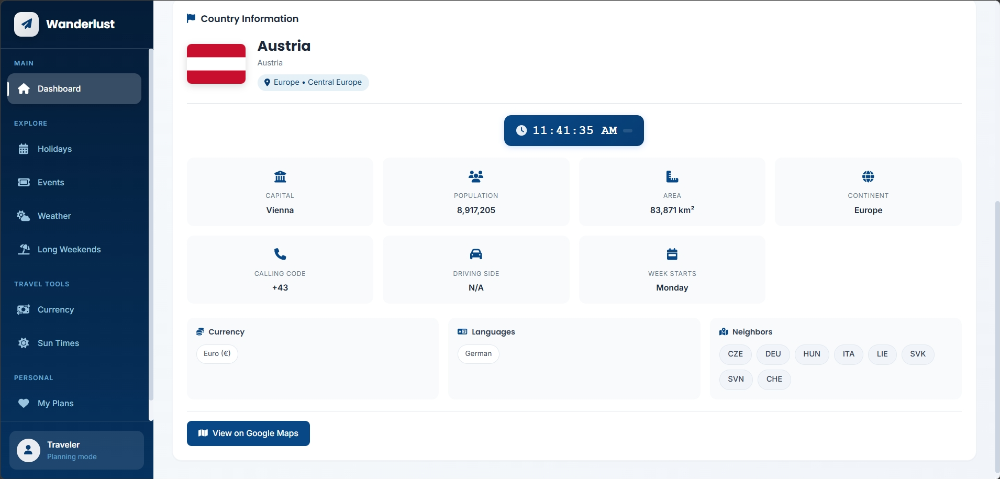
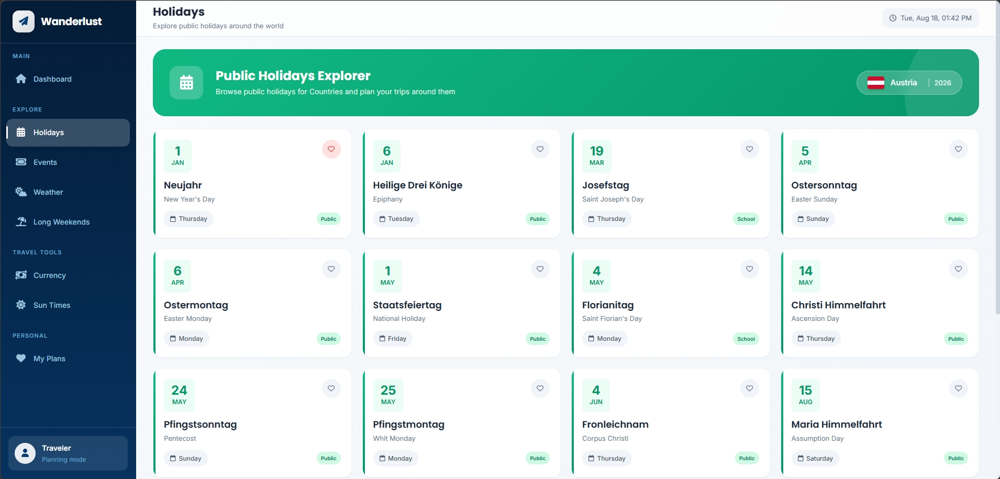
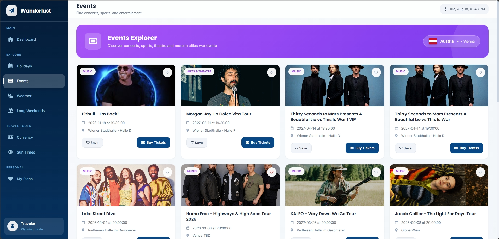
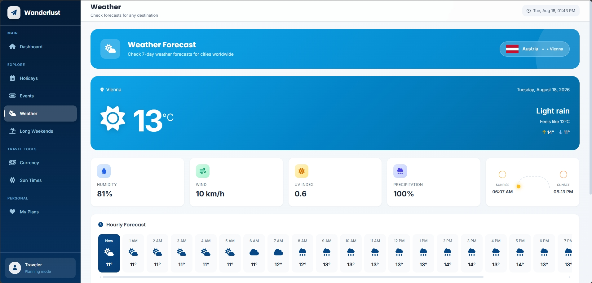
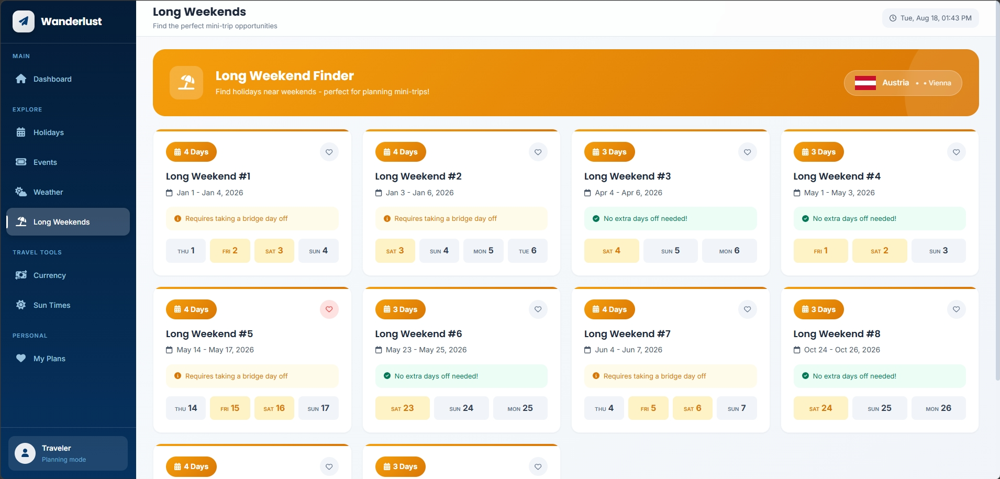
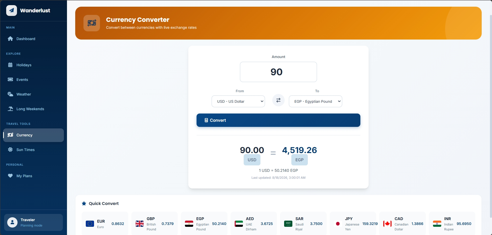
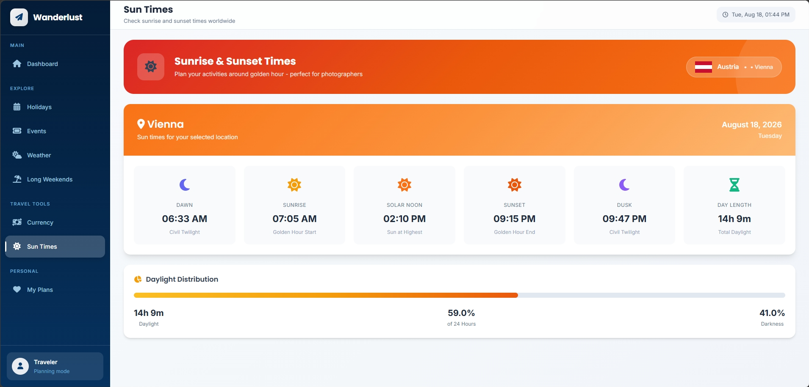
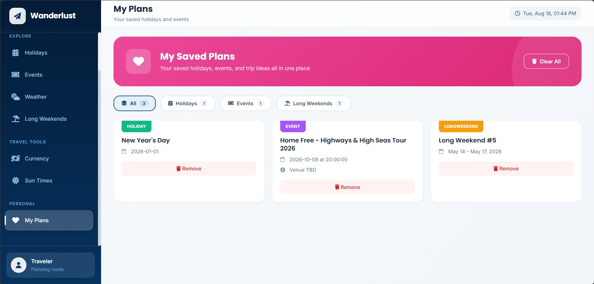

# Wanderlust Travel Dashboard

A responsive travel planning dashboard that helps users discover destinations, explore holidays and events, check weather forecasts, save travel plans, and convert currencies using live API data.

## Live Demo

(https://gehhaad.github.io/Wanderlust-Travel-Dashboard/)

## Overview

Wanderlust is an interactive travel planning web application designed to help users explore destinations and organize their travel plans in one place.

Users can select a country, city, and travel year to explore useful information about their destination, including country details, public holidays, upcoming events, weather forecasts, and currency conversion.

The application combines multiple APIs with client-side functionality to provide a dynamic travel planning experience.

## Features

- Select from a wide range of countries
- Select a destination city
- Select a travel year
- View detailed country information
- Explore public holidays
- Discover events in the selected city
- View current weather information
- View a 7-day weather forecast
- Save holidays, events, and long weekends to My Plans
- Remove saved plans
- Store travel plans using LocalStorage
- Convert between different currencies
- Use live currency exchange rates
- Responsive design for different screen sizes
- Dynamic views with URL routing
- Object-Oriented JavaScript architecture

## Dashboard

The Dashboard is the main view of the application.

Users can select:

- Country
- City
- Travel year

After making a selection, the dashboard displays useful information about the selected destination.

### Country Information

The dashboard provides information such as:

- Country name
- Official name
- Capital
- Population
- Area
- Region
- Subregion
- Calling code
- Currency
- Languages
- Bordering countries
- Country flag
- Local time
- Google Maps location

## Discovery Tools

Wanderlust provides several discovery tools to help users plan their trip.

### Holidays

The Holidays section displays public holidays for the selected country and year.

Users can explore holiday information and save interesting dates to their travel plans.

### Events

The Events section allows users to discover events taking place in the selected city.

Events can include different types of activities and entertainment that may be useful when planning a trip.

### Weather

The Weather section provides detailed weather information for the selected destination.

It includes:

- Current weather
- Temperature
- Humidity
- Wind speed
- Weather conditions
- 7-day forecast
- Daily weather information

## My Plans

The My Plans section allows users to save travel-related items for later.

Users can save:

- Holidays
- Events
- Long weekends

Saved plans are stored in the browser using LocalStorage.

Users can also remove saved plans whenever they are no longer needed.

## Currency Converter

The Currency Converter helps users calculate exchange values between different currencies.

Users can:

- Select a source currency
- Select a target currency
- Enter an amount
- View the converted value
- Use live exchange rates

This makes it easier to estimate travel expenses before and during a trip.

## URL Routing

The application uses dynamic URL routing for its different views.

Each main section can be accessed through its own URL path, such as:

- `/`
- `/weather`
- `/plans`
- `/currency`

This provides a smoother navigation experience and makes the application structure easier to understand.

## Data & APIs

The application uses external APIs to retrieve live travel-related information.

The APIs provide data for:

- Countries
- Country details
- Public holidays
- City coordinates
- Weather forecasts
- Events
- Currency exchange rates

The application processes the API responses and dynamically updates the user interface based on the selected destination.

## LocalStorage

LocalStorage is used to persist the user's saved travel plans.

This means saved plans remain available after:

- Refreshing the page
- Closing the browser
- Returning to the application later

Users can add and remove saved plans without requiring a backend database.

## Object-Oriented JavaScript

The application uses Object-Oriented Programming concepts to organize JavaScript functionality and keep the application structure maintainable.

Different responsibilities are organized into reusable objects and methods, making the code easier to manage and extend.

## Responsive Design

The application is designed to work across different screen sizes.

Responsive behavior is implemented using CSS Media Queries.

The layout adapts to:

- Desktop
- Tablet
- Mobile

## Technologies Used

- HTML5
- CSS3
- JavaScript
- REST APIs
- Media Queries
- LocalStorage
- Object-Oriented Programming (OOP)

## Screenshots

### Dashboard



### Country Information



### Holidays



### Events



### Weather



### Long Weekends



### Currency



### Sun Times



### Plans



## Project Structure

```text
Wanderlust-Travel-Dashboard/
│
├── src/
│   └── css/
│       └── base.css
│       └── components.css
│       └── dashboard.css
│       └── layout.css
│       └── utilities.css
│       └── views.css
│       └── weather.css
│       └── widgets.css
│   └── js/
│       └── main.js
│
├── screenshots/
│   └── screenshots of project
│
├── index.html
│
└── README.md
